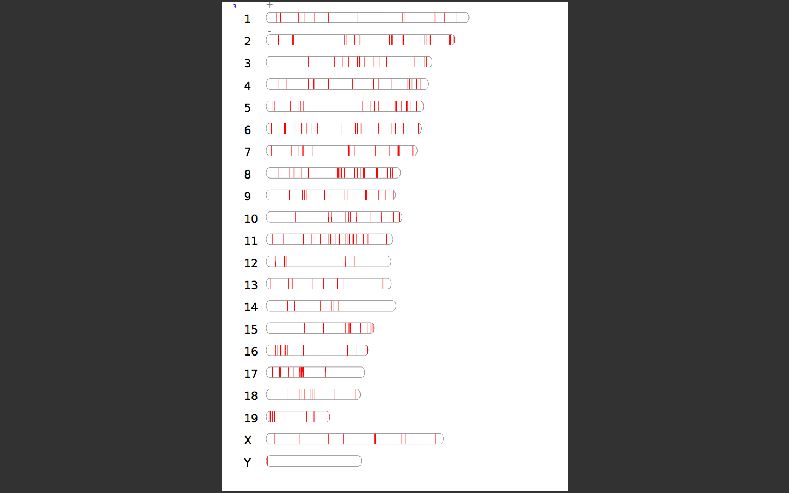

# How to use

## Python Version

* 3.x

## Python Dependencies

* mysql-connector-python (2.0.4)
* openpyxl (2.4.0)
* sortedcontainers (1.5.4)

## Options

* -s,--setting:setting config file path
* -g,--genome:section in the setting config file
* -d,--data:dir or file,data files that needs to be dealed 
* -r,--result:dir or file,result files that was generated by app
* -c,--cluster:dir or file,cluster files that needs to be clustered
* -e,--record:row count numbers of a cluster
* -t,--threshold:add a number for region place
* -o,--coverage:filter value of Coverage column value
* -f,--frequency:filter value of Frequency column value
* -b,--bed:source definition file(bed file) including cds,5utr,3utr,intron position in _result directory
* -x,--exon:need to be dealed file in data directory
* --intersectClusterName:repfamily,repclass,repclassrepfamily

## Examples

###1.mark repclass,repfamily(sine,line,ltr,dna)

> 对原始文件(必须包含chromosome,region列,文件类型.xlsx,位于data目录),
> 检索远端数据库并标记位点的repClass,repFamily,
> 生成结果文件csv位于result目录
```shell
./app.py -s settings.ini -g GRCm38 -d ../data/09102016/Medium/WT-4/WT-4\ C\ to\ A\ 5648.xlsx
./app.py -s settings.ini -g GRCm38 -d ../data/09102016/
```

###2.statistic repfamily count

> 对已经插入repClass,repFamily(共8列，sine,line,ltr,dna(*2))的结果文件(位于result目录,文件类型.csv)进行统计，
> 每个结果文件包含多少class，
> 多少family生成结果一个文件(.csv)位于tools(GRCm38_RepeatMasker_stats_result.csv)_result目录,
> 默认统计每一个文件中每一个repfamily有出现多少次

```shell
./app.py -s settings.ini -g GRCm38 -r ../result/09102016/Medium/WT-4/result_WT-4\ C\ to\ A\ 5648.csv
./app.py -s settings.ini -g GRCm38 -r ../result/09102016/
```

> 可选参数intersectClusterName:["repfamily","repclass","repclassrepfamily"]
> * repfamily:统计每一个repfamily上有多少个不同的clustername
> * repclass:统计每一个repclass上有多少个不同的clustername 
> * repclassrepfamily:统计所有clustername中有多少个
> * clustername会与repclass或者repfamily产生交集，后者8列中至少存在一列与clustername相交
 
```shell
./app.py -s settings.ini -g GRCm38 -r ../result/09242016 --intersectClusterName=repclassrepfamily
```

###3.cluster file

> 对原始文件(必须包含chromosome,region，文件类型：xlsx,csv,位于data目录),
> 根据提供的参数，按照就近划分原则(region值从小到大)进行分割，
> 并插入第一列Clustername与结果文件(csv格式)中,
> 划分片段的原则是：根据Region值就近选择！

```shell
./app.py -c ../data/09102016/Medium/WT-4/WT-4\ C\ to\ A\ 5648.xlsx -e 3 -t 2500 -o 5 -f 5
./app.py -c ../data/09102016/ -e 3 -t 2500 -o 5 -f 5
```

###4.mark CDS,5UTR,3UTR,INTRON

> bed 文件有utils/kg2bed工具生成,置于tools/_data目录

```shell
./app.py -x ../data/09242016 -b _data/GRCm38_CDS_53UTR_INTRON.csv
```

#


# Idiographic

## Options

* -i:single file or directory
* -c:roi data columns
* -b:observe column,cluster name column
* -r:region column,generates left and right column base this column
* -n:no repeat column,get only one clustername from one group cluster
* -o:operator:gen,rename,post,gmail

> get roi data from single file or directory
```
./idiographica.py -i ../data/11182016-1.1/ -c 0,9,10 -b 0 -r 9 -n 0 -o gen
```
> chanage original file to idiographica map file
```
./idiographica.py -i ../result/11182016-1-idio/ -o rename
```
> batch post data to remote idiographic
```
> ./idiographica.py -i _result/idiographica/11182016-1-idio/ -o post -f gmail.download.ini
```
> download pdf from gmail
```
> ./idiographica.download.py -g gmail.download.ini -r _result/idiographica_rename.csv -p _result/idiographica_post.csv
```
### Screen




